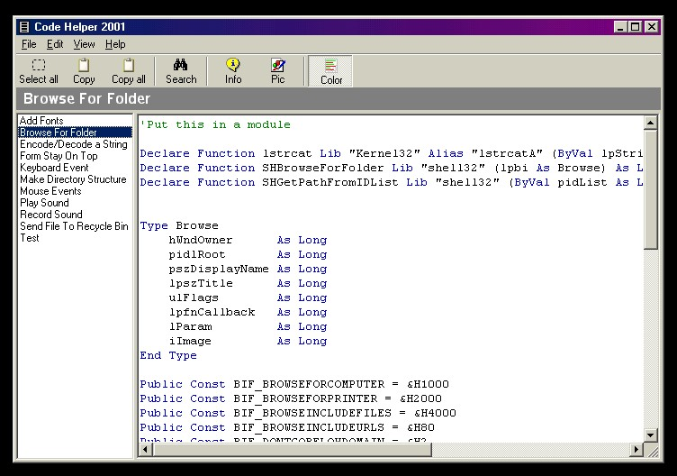



## Code Helper 2001

### Description

Code Helper 2001 is a way of viewing code stored in a file. You have the option of syntax coloring. You can add information or/and a picture to each seperate bit of code.
 
### More Info
 

             |
---                |---
**Submitted On**   |2001-09-27 18:35:00
**By**             |[CoderFromHell](https://github.com/Planet-Source-Code/PSCIndex/blob/master/ByAuthor/coderfromhell.md)
**Level**          |Advanced
**User Rating**    |4.7 (14 globes from 3 users)
**Compatibility**  |VB 5\.0
**Category**       |[Libraries](https://github.com/Planet-Source-Code/PSCIndex/blob/master/ByCategory/libraries__1-49.md)
**World**          |[Visual Basic](https://github.com/Planet-Source-Code/PSCIndex/blob/master/ByWorld/visual-basic.md)
**Archive File**   |[Code Helpe270499272001\.zip](https://github.com/Planet-Source-Code/coderfromhell-code-helper-2001__1-27589/archive/master.zip)

